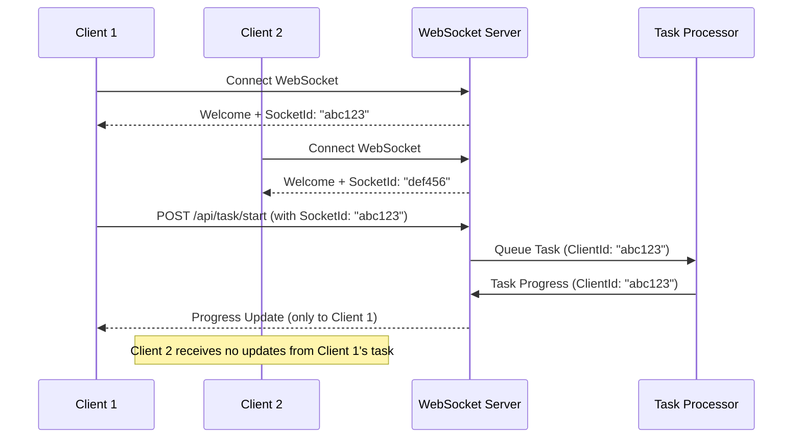

```sequenceDiagram
    participant C1 as Client 1
    participant C2 as Client 2
    participant WS as WebSocket Server
    participant TP as Task Processor

    C1->>WS: Connect WebSocket
    WS-->>C1: Welcome + SocketId: "abc123"
    
    C2->>WS: Connect WebSocket  
    WS-->>C2: Welcome + SocketId: "def456"
    
    C1->>WS: POST /api/task/start (with SocketId: "abc123")
    WS->>TP: Queue Task (ClientId: "abc123")
    
    TP->>WS: Task Progress (ClientId: "abc123")
    WS-->>C1: Progress Update (only to Client 1)
    
    Note over C2: Client 2 receives no updates from Client 1's task
```

I'll help you update the websocket implementation to properly handle task separation by client/socket ID. Let me first explore the current codebase structure to understand the existing implementation.
Ran tool

Ran tool
Ran tool

Read file: backend/Program.cs
Ran tool
Ran tool

Read file: backend/Services/WebSocketManager.cs
Read file: backend/Services/IWebSocketManager.cs
Read file: backend/Controllers/TaskController.cs

Read file: backend/Services/TaskQueue.cs
Read file: backend/Services/TaskProcessor.cs
Read file: backend/Services/BackgroundTaskService.cs

Ran tool

Read file: backend/Models/TaskItem.cs
Read file: backend/Models/TaskRequest.cs
Read file: backend/Models/WebSocketMessage.cs

Ran tool

Ran tool
Ran tool

Ran tool

Ran tool
Ran tool
Ran tool

Ran tool

Ran tool
Ran tool

Ran tool

Ran tool

Ran tool

Ran tool

Ran tool

Read file: frontend/src/lib/websocket.ts

Ran tool
Ran tool

Ran tool

Ran tool
Ran tool

Ran tool

Ran tool

```bash
cd backend && dotnet build
```

Perfect! I've successfully implemented the client-specific task monitoring system for your WebSocket application. Here's a comprehensive summary of the changes made:

## 🎯 **Key Improvements**

### **Backend Changes**

1. **Enhanced Data Models**
   - Added `ClientId` field to `TaskItem` to track which client triggered each task
   - Updated `TaskRequest` to accept optional client identification

2. **WebSocket Manager Enhancements**
   - **New Methods**: `SendMessageToClientAsync()` for targeted messaging to specific clients
   - **Reverse Lookup**: Added mapping from WebSocket objects to socket IDs for efficient client identification
   - **Proper Cleanup**: Enhanced connection/disconnection handling to maintain data integrity

3. **Smart Client Detection**
   - **Multi-source ID Detection**: TaskController now checks multiple sources for client ID:
     - Request body `clientId`
     - `X-Socket-Id` header (for WebSocket clients)
     - `X-Session-Id` header (for session-based clients)
     - `X-Client-Id` header (generic identifier)
     - Fallback: generates unique ID if none provided

4. **Targeted Task Processing**
   - **Isolated Updates**: Task progress now sent only to the originating client
   - **No Cross-Client Interference**: Each client receives only their own task updates

### **Frontend Changes**

1. **Enhanced WebSocket Integration**
   - Frontend now captures and stores the socket ID from server connection
   - API calls include socket ID for proper client identification

2. **Updated Task Management**
   - Task creation automatically includes client identification
   - UI properly associates tasks with the current client session

## 🔄 **How It Works**



## ✅ **Benefits Achieved**

- **✅ Client Isolation**: Each WebSocket connection monitors only tasks triggered by that specific client
- **✅ Targeted Updates**: Task progress sent exclusively to the originating client
- **✅ No Cross-Client Interference**: Multiple clients can work simultaneously without seeing each other's tasks
- **✅ Flexible Client ID Sources**: Supports multiple methods of client identification
- **✅ Backwards Compatibility**: Fallback mechanisms ensure system robustness
- **✅ Scalable Architecture**: Clean separation of concerns for future enhancements

The implementation now properly ensures that **"tasks must be separated by socket id or client's session id and any particular task updates need to be sent to the only client who has triggered such task"** as requested.

Your WebSocket system now provides true multi-client isolation while maintaining all existing functionality! 🚀